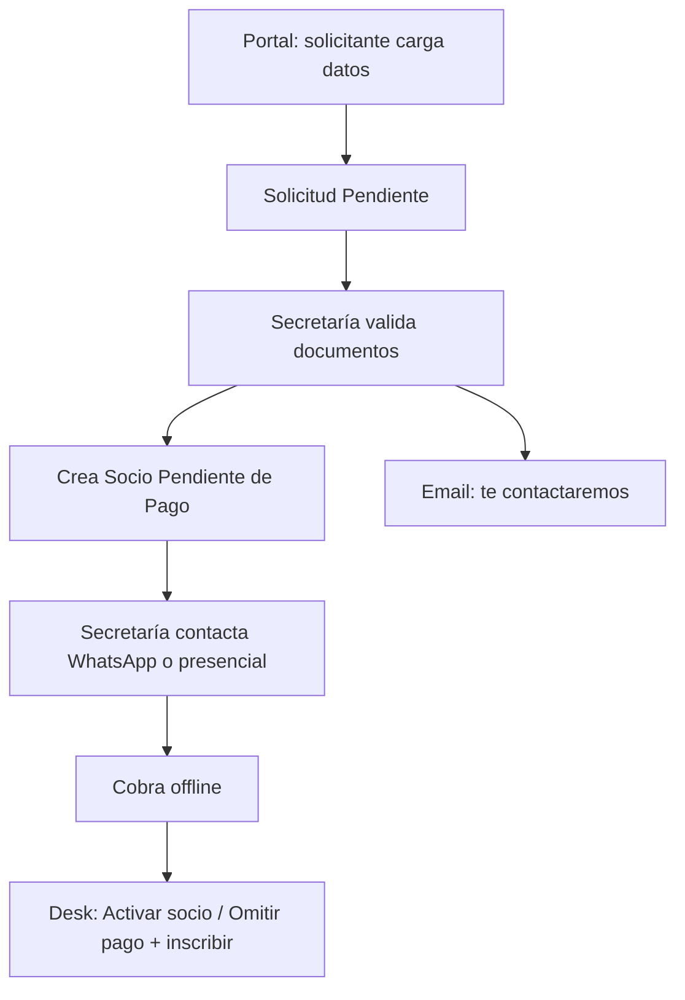

# Spec: Alta pública sin pago online (hasta Cobros Plus)

**Relacionado:** `mvp_operacion_secretaria_sin_pagos.md`, `solicitud_asociacion_publica.md`,
`portal_alta_grupo_familiar.md`

Hasta que esté **Cobrand / Cobros Plus**, el alta pública **no** cobra online.
El pago se cierra presencialmente o por WhatsApp con Secretaría.

---

## Flujo operativo (hoy)

1. El potencial socio (o la familia) **carga la solicitud** en el portal.
2. Secretaría **valida** los datos y documentos.
3. El sistema crea `Socio` + `User` en `Pendiente de Pago` y envía un email **sin**
   link de pago: informa que Secretaría se contactará.
4. Secretaría contacta (WhatsApp / presencial), cobra y **da de alta** con las
   acciones Desk ya existentes (`Activar socio`, `Omitir pago`, inscripción).

---

## Scenario: validar sin pago online (default)

Given `Club Settings.habilitar_pago_online_alta = 0` (default)
And una `Solicitud Asociacion` en `Pendiente`
When Secretaría la valida
Then se crea el `Socio` en `Pendiente de Pago` (igual que hoy)
And se encola un email al destinatario de contacto
And el email **no** incluye `/pago-stub` ni CTA «Pagar primera cuota»
And el email indica que Secretaría se contactará para completar el alta
And el subject no promete pago online («Solicitud validada — próximo paso»).

---

## Scenario: reactivar link de pago cuando Cobros Plus esté listo

Given `Club Settings.habilitar_pago_online_alta = 1`
When Secretaría valida una solicitud
Then el email vuelve a incluir el link de pago firmado (comportamiento legacy / futuro Cobros Plus).

---

## Scenario: cola operativa de Secretaría

Given socios en `Pendiente de Pago` creados por validación sin pago online
When Secretaría abre Desk
Then puede usar **Omitir pago (alta manual)** y/o **Activar socio** tras el cobro offline
  (ya especificado en `mvp_operacion_secretaria_sin_pagos.md`).

---

## Configuración

| Campo | DocType | Default | Notas |
|-------|---------|---------|-------|
| `habilitar_pago_online_alta` | `Club Settings` (Check) | `0` | Off hasta Cobros Plus |

---

## Fuera de alcance

- Integración Cobrand / Cobros Plus / Supervielle (sprint de pagos).
- Cambiar el estado post-validación a otro distinto de `Pendiente de Pago`.
- WhatsApp Business API: el contacto es manual; el email solo avisa.
