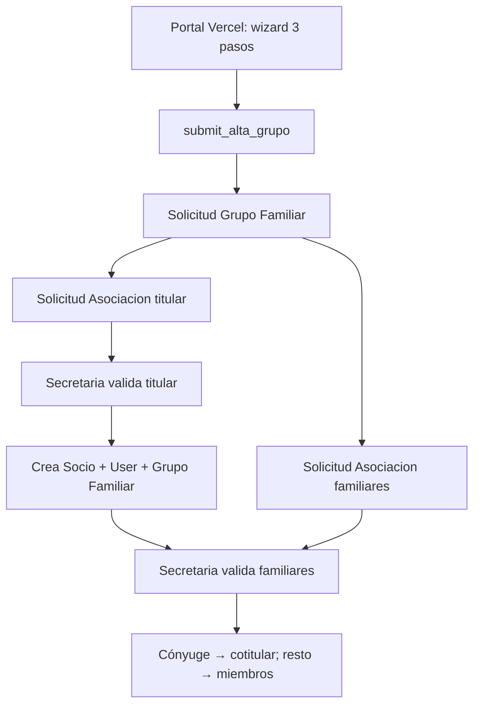

# Spec: Portal de alta con grupo familiar (wizard multi-persona)

**Backlog:** BL-6
**Relacionado:** `solicitud_asociacion_publica.md`, `portal_socio_inscripcion.md`,
`activities_modulo.md`, `grupo_familiar_minimo.md`

**Referencia de UX:** flujo de asociación de Club Sportivo Pilar
(`/inscripcion-socio`): wizard de 3 pasos — *Tus datos* → *Tu familia* → *Listo*,
con actividades elegidas dentro del alta y opción explícita «Socio sin actividad».

---

## Campaña pública `/asociate` (landing)

La página de asociarse **no** es el formulario: es una campaña (tono
[sumate.estudiantesdelaplata.com](https://sumate.estudiantesdelaplata.com/))
que explica **por qué** y **cómo** sumarse. El wizard vive en
`/asociate/inscripcion`.

**Diferencia con Estudiantes:** el envío deja al interesado **pre-asociado**;
Secretaría contacta y da el **alta definitiva** (`alta_sin_pago_online.md`).
El detalle de que el pago no se hace en el sitio vive solo en **Dudas rápidas**.

### Scenario: el visitante entiende el proceso sin abrir el formulario

Given un visitante abre `https://www.icdpedroechague.com.ar/asociate`
When recorre la campaña
Then ve, en orden, al menos:
1. Completar la solicitud (datos + documentación)
2. Quedar **pre-asociado** (código de seguimiento; aún no es socio activo)
3. Secretaría revisa y contacta por WhatsApp o en el club
4. Alta definitiva
And un CTA único lleva a `/asociate/inscripcion`.

### Scenario: un solo formulario, individual o familiar

Given el visitante quiere asociarse solo o con su familia
When pulsa el CTA de la campaña
Then un único botón lleva al wizard (`/asociate/inscripcion`)
And se aclara que el grupo familiar se carga en el mismo trámite
And se destaca el descuento de cuota social a partir del segundo integrante.

---

## Objetivo

Que una familia complete **un solo trámite público** y quede cargada como
titular + familiares, cada uno con **sus propias actividades**, sin que
Secretaría tenga que unir grupos a mano.

Hoy el alta pública es **una persona por solicitud** y el vínculo familiar es
declarativo (`tiene_familiares_socios`, `familiares_existentes_dnis`): Secretaría
decide la unión manualmente.

---

## Decisión de modelado: padre + N solicitudes

Una `Solicitud Asociacion` **sigue representando a una persona**. El trámite
familiar se modela con un DocType padre nuevo:

```
Solicitud Grupo Familiar (1)
  └── Solicitud Asociacion (N)   ← una por persona, con rol_en_grupo
```

Motivos:

1. `Solicitud Asociacion` tiene ~60 campos planos (solicitante + tutor). Convertirla
   en multi-persona obligaría a reescribir workflow, corrección pública, validación,
   notificaciones y tests existentes.
2. Secretaría necesita **aprobar o rechazar persona por persona**: es habitual que
   el titular esté completo y a un hijo le falte la ficha médica.
3. Todo el camino ya probado (`validar_solicitud.py`, workflow, `solicitud_tokens`,
   `grupo_familiar.py`) se reutiliza sin cambios estructurales.

### Orden de validación

El **titular se valida primero**: es quien crea el `Grupo Familiar`. Los familiares
validados después se incorporan a ese grupo.

Validar un familiar antes que el titular es un error de operación con mensaje explícito,
no un fallo silencioso.



---

## Modelo de datos

### DocType `Solicitud Grupo Familiar`

| Campo | Tipo | Notas |
|-------|------|-------|
| `apellido_principal` | Data, reqd | Apellido del titular; nombra el grupo |
| `email_contacto` | Data, reqd | Email del titular; receptor de notificaciones |
| `token_seguimiento` | Data, read_only, unique | **Un solo token para todo el trámite** |
| `enviado_desde_ip` | Data, read_only | Auditoría y rate-limit |
| `solicitud_titular` | Link `Solicitud Asociacion`, read_only | Quién crea el grupo |
| `grupo_familiar_generado` | Link `Grupo Familiar`, read_only | Se setea al validar al titular |
| `cantidad_personas` | Int, read_only | Denormalizado para la cola de Secretaría |

`Guest` **no** tiene DocPerm. La única vía de creación es el endpoint whitelisted.

### Child table `Actividad Solicitada`

| Campo | Tipo | Notas |
|-------|------|-------|
| `actividad` | Link `Actividad`, reqd | Solo actividades habilitadas |
| `grupo_actividad` | Link `Grupo Actividad` | Solo cuando el grupo es el plan/arancel |
| `notas` | Small Text | Texto libre del solicitante |

Reemplaza al texto libre `actividad_interes`, que queda como campo legacy para las
solicitudes ya cargadas.

### Campos nuevos en `Solicitud Asociacion`

| Campo | Tipo | Notas |
|-------|------|-------|
| `solicitud_grupo` | Link `Solicitud Grupo Familiar`, read_only | Vacío en altas individuales |
| `rol_en_grupo` | Select: `Titular`/`Cónyuge`/`Hijo`/`Padre`/`Madre`/`Otro` | Rol con el que entra al grupo |
| `actividades_solicitadas` | Table `Actividad Solicitada` | Elección del wizard |
| `sin_actividad` | Check | «Socio sin actividad» de la UX de Pilar |
| `comprobante_jubilado` | Attach | Obligatorio si `categoria_solicitada = Jubilado` (comprobante / recibo de haberes) |

---

## Scenario: alta familiar completa desde el portal

Given un titular adulto y dos familiares (cónyuge y un hijo menor)
And cada persona con su propia selección de actividades
When el portal llama `submit_alta_grupo` con `{ titular, familiares: [...] }`
Then se crea **una** `Solicitud Grupo Familiar` con `cantidad_personas = 3`
And **tres** `Solicitud Asociacion` en estado `Pendiente`, todas con el mismo `solicitud_grupo`
And el titular queda referenciado en `solicitud_grupo.solicitud_titular` con `rol_en_grupo = Titular`
And la respuesta expone **un solo** `token_seguimiento` y **no** expone los `name` de los documentos.

---

## Scenario: cada persona conserva sus actividades

Given el titular elige «Basquet» y el hijo elige «Futbol» y «Voley»
When se crea el trámite
Then la solicitud del titular tiene una fila en `actividades_solicitadas` con `Basquet`
And la del hijo tiene dos filas, `Futbol` y `Voley`
And ninguna selección se mezcla entre personas.

---

## Scenario: socio sin actividad

Given una persona marca «Socio sin actividad»
When se crea su solicitud
Then `sin_actividad = 1` y `actividades_solicitadas` queda vacío
And la solicitud es válida (no se exige elegir actividad).

---

## Scenario: categoría según edad y Adherente / Jubilado

Given una persona con fecha de nacimiento (edad calculada en el portal y en servidor)
When elige `categoria_solicitada` en el wizard
Then las opciones permitidas son:
- **≥ 18 años:** `Activo` (sugerida), `Adherente`, `Jubilado`
- **< 18 años:** `Menor` (sugerida), `Adherente`
And no se acepta `Jubilado` si es menor de 18 ni `Activo` si es menor de 18 ni `Menor` si es mayor de 18.
And `get_catalogo_alta` expone `categorias` sin `Cadete`, `adjuntos` con `comprobante_jubilado` y `actividades_adherente`.

### Adherente (con o sin mayoría de edad)

Given `categoria_solicitada = Adherente`
When se crea la solicitud
Then solo puede solicitar actividades del conjunto permitido:
`Gimnasio Fitness`, `Funcional`, `Yoga`, `Crossfit`
And cualquier otra actividad del payload se descarta
And si no queda ninguna actividad permitida, la solicitud se marca `sin_actividad`
And un menor Adherente en el trámite familiar sigue hidratando tutor desde el titular.

### Jubilado (≥ 18)

Given `categoria_solicitada = Jubilado`
When se envía el alta
Then es obligatorio el adjunto `comprobante_jubilado` (comprobante de jubilación o recibo de haberes, URL `/files/...`)
And sin ese adjunto el endpoint rechaza con `ValidationError`.

---

## Scenario: actividad inexistente o deshabilitada

Given el payload trae una actividad que no existe o está deshabilitada
When se llama `submit_alta_grupo`
Then la fila se descarta y el resto del alta se crea igual
And el descarte no rompe el trámite ni expone el catálogo interno.

---

## Scenario: el titular crea el grupo al validarse

Given un trámite familiar con las tres solicitudes en `Pendiente`
When Secretaría valida la solicitud del **titular**
Then se crean `Socio`, `User` y un `Grupo Familiar` nuevo
And `solicitud_grupo.grupo_familiar_generado` queda apuntando a ese grupo.

---

## Scenario: el cónyuge entra como cotitular automático

Given el titular ya validado y `grupo_familiar_generado` seteado
And una solicitud de cónyuge adulto con `rol_en_grupo = Cónyuge`
When Secretaría la valida
Then se crea su `Socio` **sin** crear un `Grupo Familiar` nuevo
And el socio se agrega a `titulares` del grupo con `rol = Cotitular`, `es_principal = 0` y `hasta` vacío
And `Socio.grupo_familiar` apunta a ese grupo
And el sync del DocType también lo deja reflejado en `miembros` (como todo titular Socio).

Secretaría puede **quitar la titularidad** después en Desk poniendo `hasta` en la fila
de `titulares` (el cónyuge deja de ser cotitular activo; el grupo conserva al principal).

---

## Scenario: familiar adulto que no es cónyuge entra como miembro

Given el titular ya validado
And una solicitud con `rol_en_grupo = Otro` (u otro rol no-cónyuge adulto)
When Secretaría la valida
Then el socio queda en `miembros` del grupo con ese rol
And **no** se agrega a `titulares`.

---

## Scenario: el menor usa al titular como tutor

Given una solicitud `Menor` dentro del trámite con `dni_tutor` = DNI del titular
And el titular ya validado como `Socio`
When Secretaría valida al menor
Then aplica el camino existente `_validar_menor_con_tutor_socio`
And el menor entra como miembro `Hijo` del grupo del titular.

---

## Scenario: validar un familiar antes que el titular

Given un trámite familiar donde el titular sigue en `Pendiente`
When Secretaría intenta validar primero a un familiar
Then se aborta con el mensaje «Validá primero la solicitud del titular del grupo»
And no se crean `Socio` ni `Grupo Familiar`.

---

## Scenario: consulta pública del trámite

Given un `token_seguimiento` de un trámite familiar
When el portal llama `consultar_alta_grupo`
Then recibe el estado **por persona** (nombre, rol y `workflow_state`)
And no recibe DNI, adjuntos ni datos de contacto de los demás integrantes.

---

## Scenario: token inválido

Given un token inexistente o manipulado
When el portal consulta el trámite
Then responde error genérico `Not Found`, sin distinguir entre inexistente y ajeno.

---

## Contrato API (frontend Vercel)

Todos los endpoints son `@frappe.whitelist(allow_guest=True)`.

| Método | Uso |
|--------|-----|
| `club_management.members.api.alta_grupo_publica.get_catalogo_alta` | Catálogo del wizard: actividades habilitadas y categorías |
| `club_management.members.api.alta_grupo_publica.submit_alta_grupo` | Alta multi-persona. Rate limit 5 / 600 s por IP |
| `club_management.members.api.alta_grupo_publica.consultar_alta_grupo` | Estado del trámite por token |

### Payload de `submit_alta_grupo`

```json
{
  "titular": {
    "nombre": "Ana", "apellido": "Pérez", "dni": "30123456",
    "fecha_nacimiento": "1990-03-01", "genero": "Femenino",
    "email": "ana@example.com", "telefono_movil": "+541112345678",
    "calle": "Falsa", "numero": "123", "provincia": "Buenos Aires",
    "localidad_barrio": "Pilar", "codigo_postal": "1629",
    "categoria_solicitada": "Activo",
    "actividades": [{ "actividad": "Basquet" }],
    "sin_actividad": 0
  },
  "familiares": [
    {
      "nombre": "Luca", "apellido": "Pérez", "dni": "55123456",
      "rol_en_grupo": "Hijo", "categoria_solicitada": "Menor",
      "actividades": [{ "actividad": "Futbol" }]
    }
  ]
}
```

Respuesta: `{"status": "ok", "token_seguimiento": "<hex>", "personas": 2}`.

### Requisitos de integración

- **CORS**: `allow_cors` en `site_config.json` con el origen del sitio en Vercel.
  No se commitea; se documenta en la skill de deploy.
- Adjuntos: se suben con `frappe.client.upload_file` (`allow_guest=True`) y se
  referencian como URLs `/files/...`, igual que el alta individual.
- Errores genéricos ante token inválido; sin enumeración de documentos.

---

## Fuera de alcance

- Promoción automática de otros roles (Padre/Madre/Otro) a cotitulares: solo el
  `Cónyuge` entra como cotitular; el resto queda en `miembros` salvo decisión
  manual de Secretaría en Desk.
- **Pago online del trámite** (Cobrand / Cobros Plus): ver `alta_sin_pago_online.md`.
  Hoy, tras validar, Secretaría contacta por WhatsApp/presencial y cierra con
  **Activar socio** / **Omitir pago** en Desk.
- Convertir `actividades_solicitadas` en `Inscripcion Actividad` automáticamente:
  la inscripción real sigue ocurriendo post-pago (`portal_socio_inscripcion.md`).
  Esta spec solo garantiza que la elección viaja con cada persona.
- Migrar el formulario Frappe `www/solicitud-asociacion.html`, que se mantiene
  operativo para el alta individual hasta el cutover a Vercel.

---

## Artefactos

| Artefacto | Ubicación |
|-----------|-----------|
| Spec | `specs/portal_alta_grupo_familiar.md` |
| Campaña landing | `pedro-echague-landing-page` `/asociate` (no es el wizard) |
| Wizard | `/asociate/inscripcion` |
| DocType padre | `members/doctype/solicitud_grupo_familiar/` |
| Child table | `members/doctype/actividad_solicitada/` |
| Servicio | `members/services/alta_grupo_familiar.py` |
| API pública | `members/api/alta_grupo_publica.py` |
| Validación | `members/services/validar_solicitud.py` (extensión) |
| Tests | `members/tests/test_alta_grupo_familiar.py` |
